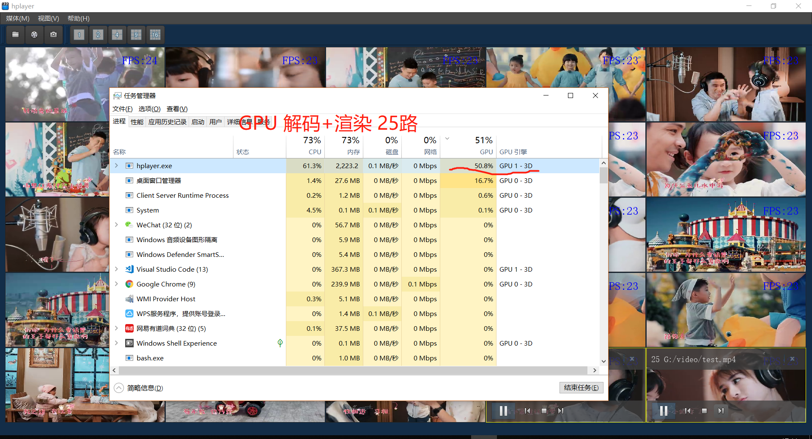

# 多画面播放器

## 需求分析

- 做一个类似VLC的播放器，能播放本地媒体文件、捕获设备、网络流；
- 界面要求多画面监控网格，可自由切换多画面风格；

## 概要设计

- 使用Qt实现界面；
- 使用FFmpeg获取帧，编解码，转码；
- 使用OpenCV处理图片；
- 使用OpenGL渲染视频帧；

## 详细设计

**界面设计**

**多画面效果图**

## 项目博客

https://blog.csdn.net/column/details/23763.html

## 后期计划

- 添加人脸检测与识别功能；
- 添加美颜功能；
- 添加图片与文字叠加功能；
- 添加多画面合成功能；
- 添加推流功能；
- 添加桌面录制功能；

## BUILD
git submodule update --init
see BUILD.md
