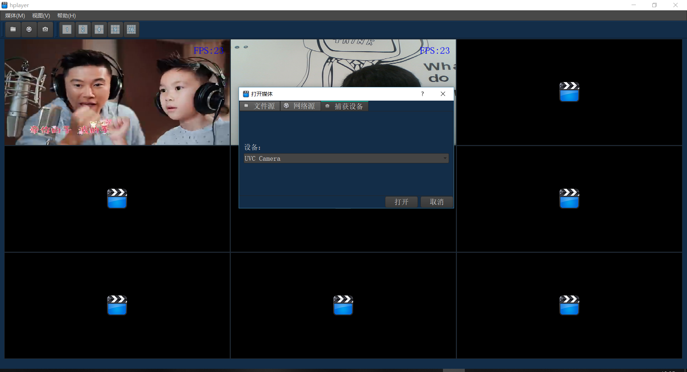
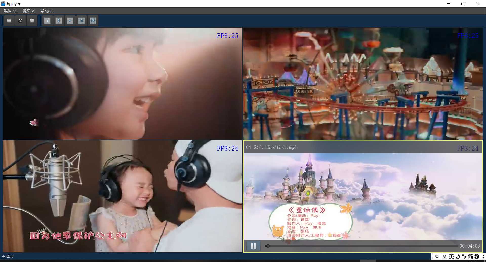
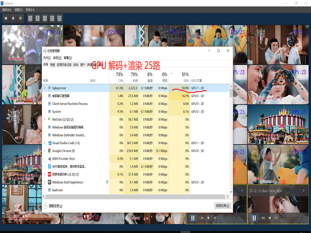

# 多画面播放器

## 需求分析

- 做一个类似VLC的播放器，能播放文件源、网络源、设备捕获源；
- 界面要求多画面监控网格，可自由切换多画面风格，支持拖拽与合并；

## 概要设计

- 使用Qt实现界面；
- 使用FFmpeg拉流，编解码，转码；
- 使用OpenCV处理图片；
- 使用OpenGL渲染视频帧；

## 详细设计

**界面设计**



**多画面效果图**





## 后期计划

- 添加显示器捕获源；
- 添加图片、文字、时间叠加功能；
- 添加多画面合成功能；
- 添加推流、录制功能；
- 添加人脸检测与识别功能；
- 添加美颜功能；

## Submodule
```
git clone --recurse-submodules https://github.com/ithewei/hplayer.git
```
or
```
git clone https://github.com/ithewei/hplayer.git
git submodule update --init
```

## Mirror
```
https://gitee.com/ithewei/hplayer.git
```

## Build

see BUILD.md

## 项目博客

https://hewei.blog.csdn.net/article/category/9275796
